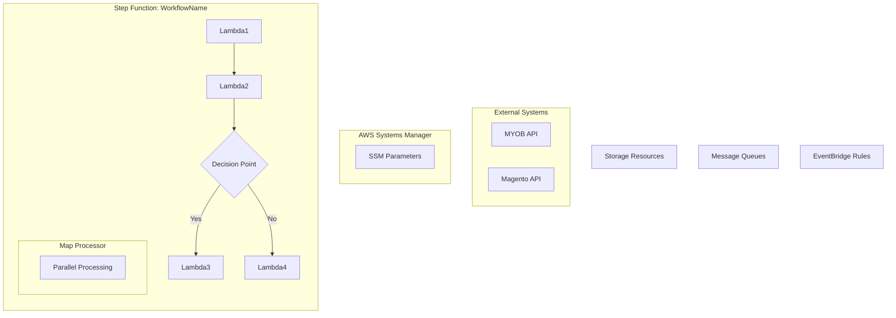

# Service Architecture Documentation Format

This document describes the process for creating comprehensive architecture diagrams for AWS CDK services, with Lambda functions properly organized within their Step Function workflows.

## Process Overview

### 1. Analyze CDK Application Structure
- Read the main application stages file (`application/lib/application-stages.ts`)
- Identify all services from the stack creation file (`application/lib/create-application-stacks.ts`)
- List all services and their descriptions
- Analyze each service to understand what business entities it integrates (products, orders, customers, etc.)

### 2. Examine Each Service's AWS Resources
For each service in the `services/` directory:
- **Lambda Functions**: Check `src/infra/functions/lambda-functions.ts`
- **Step Functions**: Look for `.asl.yaml` files in `src/infra/step-functions/`
- **Storage**: Identify S3 buckets, DynamoDB tables
- **Messaging**: Find SQS queues, SNS topics
- **API Gateway**: Check for HTTP/REST API definitions
- **EventBridge**: Look for scheduled rules
- **Other Resources**: IAM roles, CloudWatch, etc.
- **Business Logic**: Examine handler files in `src/runtime/handlers/` to understand data processing flows
- **Data Schemas**: Review `src/runtime/lib/schemas/` or `src/runtime/lib/types/` for entity definitions

### 3. Map Step Function Workflows
Read each Step Function definition file (`.asl.yaml`) to understand:
- **Sequential flows**: Linear execution of Lambda functions
- **Parallel branches**: Concurrent processing (Map states)
- **Choice logic**: Conditional branching with decision points
- **Error handling**: Retry logic and error routing
- **Loops**: Pagination and iterative processing

### 4. Create Service-Specific Diagrams
For each service, create a Mermaid flowchart with:

#### Structure:


#### Key Principles:
- **Lambda functions inside Step Functions**: Show the actual workflow execution
- **External systems**: MYOB, Magento APIs as separate entities
- **Shared resources**: SSM Parameters, EventBridge as external to Step Functions
- **Resource connections**: Show data flow and permissions with labeled arrows
- **Decision points**: Use diamond shapes for choice nodes
- **Map processors**: Show parallel/distributed processing as sub-graphs

### 5. Apply Consistent Color Palette

```mermaid
classDef external fill:#00429d,stroke:#333,stroke-width:4px,color:#fff
classDef lambda fill:#ffffe0,stroke:#333,stroke-width:2px,color:#000
classDef storage fill:#ffbcaf,stroke:#333,stroke-width:2px,color:#000
classDef orchestration fill:#4771b2,stroke:#333,stroke-width:2px,color:#000
classDef messaging fill:#f4777f,stroke:#333,stroke-width:2px,color:#000
classDef database fill:#93003a,stroke:#333,stroke-width:2px,color:#fff
classDef choice fill:#a5d5d8,stroke:#333,stroke-width:2px,color:#000
classDef ssm fill:#93003a,stroke:#333,stroke-width:2px,color:#fff
classDef eventbridge fill:#73a2c6,stroke:#333,stroke-width:2px,color:#000
classDef apigateway fill:#73a2c6,stroke:#333,stroke-width:2px,color:#000
classDef errorhandling fill:#cf3759,stroke:#333,stroke-width:2px,color:#fff
```

**Color Categories:**
- **External APIs**: `#00429d` (Primary external systems)
- **Lambda Functions**: `#ffffe0` (Service components)
- **Storage (S3)**: `#ffbcaf` (Data sources)
- **Step Functions**: `#4771b2` (Integration platforms)
- **Messaging (SQS)**: `#f4777f` (Notification systems)
- **Database (DynamoDB)**: `#93003a` (Secondary systems)
- **Choice Nodes**: `#a5d5d8` (Client applications)
- **SSM Parameters**: `#93003a` (Secondary systems)
- **EventBridge**: `#73a2c6` (Monitoring/logging)
- **API Gateway**: `#73a2c6` (Monitoring/logging)
- **Error Handling (SNS)**: `#cf3759` (Error handling systems)

## Common Step Function Patterns

### 1. Linear Sequence
```mermaid
Lambda1 --> Lambda2 --> Lambda3 --> Lambda4
```

### 2. Conditional Branching
```mermaid
Lambda1 --> Choice{Condition?}
Choice -->|Yes| Lambda2
Choice -->|No| Lambda3
Lambda2 --> Lambda4
Lambda3 --> Lambda4
```

### 3. Pagination Loop
```mermaid
Lambda1 --> Lambda2 --> More{More Data?}
More -->|Yes| Lambda1
More -->|No| End[Finish]
```

### 4. Parallel Processing
```mermaid
Lambda1 --> MapProcessor[Map: Parallel Processing]
subgraph MapProcessor
    ParallelLambda[Process Item]
end
MapProcessor --> Lambda2
```

### 5. Error Handling
```mermaid
Lambda1 --> Lambda2
Lambda2 --> ErrorCheck{Success?}
ErrorCheck -->|No| ErrorHandler[Error Handler]
ErrorCheck -->|Yes| Lambda3
ErrorHandler --> Cleanup[Cleanup]
```

## Documentation Structure

### Main Architecture File
Create `ARCHITECTURE.md` with:
1. **Overview**: List all services and their purposes
2. **Integrated Business Entities**: Comprehensive list of all business entities integrated by the application
3. **Individual Service Diagrams**: One diagram per service
4. **Resource Summary Table**: Count of resources by service
5. **Common Patterns**: Shared architectural patterns
6. **Security & Permissions**: IAM and access patterns

### Service-Specific Sections
For each service include:
- **Purpose**: Brief description of what the service does
- **Mermaid Diagram**: Visual representation of the architecture
- **Key Components**: Lambda functions, Step Functions, storage, etc.
- **External Dependencies**: API calls, shared resources
- **Scheduling**: EventBridge rules and timing
- **Error Handling**: How errors are managed

## Tools and Commands

### Analysis Commands
```bash
# Find all Step Function definitions
find services -name "*.asl.yaml" -type f

# List all Lambda function files
find services -name "lambda-functions.ts" -type f

# Check service stack files
find services -name "index.ts" -path "*/src/index.ts"
```

### Validation
- Ensure all Lambda functions referenced in Step Functions exist
- Verify resource connections match IAM permissions
- Check that external API calls are properly documented
- Validate color palette consistency across all diagrams

## Best Practices

1. **Accuracy**: Diagrams should reflect actual implementation
2. **Clarity**: Use consistent naming and clear labels
3. **Completeness**: Include all significant resources and connections
4. **Maintainability**: Update diagrams when services change
5. **Accessibility**: Use high contrast colors with appropriate text colors
6. **Logical Grouping**: Group related resources in sub-graphs
7. **Flow Direction**: Show data flow and execution sequence clearly

This format ensures comprehensive, consistent, and maintainable architecture documentation for AWS CDK microservices.