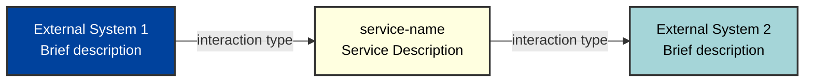

# SERVICE NAME

## Overview

Brief description of what the service does and its role in the system.

### Purpose

Why this service exists - the business problem it solves.

### Core Requirements

- Key functional requirements (use bullet points)
- Critical constraints or rules the service must follow
- Important integration requirements

## Context Diagram

**Colour Palette:**

Service:
- `#ffffe0` (Black text)

External entities:
- `#00429d` (White text) - Primary external APIs
- `#93003a` (White text) - Secondary systems
- `#a5d5d8` (Black text) - Client applications
- `#ffbcaf` (Black text) - Data sources
- `#4771b2` (Black text) - Integration platforms
- `#73a2c6` (Black text) - Monitoring/logging
- `#f4777f` (Black text) - Notification systems
- `#cf3759` (White text) - Error handling systems

**Instructions for Context Diagram:**

- Show ONLY external systems that interact with this service
- Do NOT include AWS services like EventBridge, SQS, SNS, etc. - these are internal infrastructure
- Treat the service as a black box - don't show internal components
- Use colors from the defined palette below
- Service always uses #ffffe0 (light yellow)
- External entities use colors from the palette based on system type
- Label interactions clearly (what data flows between systems)
- Keep it simple - focus on the service's role in the larger ecosystem

## Key workflows

### Main Workflow Name

1. **Step 1**: What happens first
2. **Step 2**: What happens next
3. **Step 3**: And so on...

### Secondary Workflow (if applicable)

Brief description of other important processes.

## Critical information

### Section Name

- **Key Point**: Important details that operators need to know
- **Another Point**: Critical constraints or behaviors

### Performance/Timing

- Important timing constraints
- Performance characteristics
- Scheduling information

### Data Integrity

- How the service ensures data consistency
- Error handling approaches
- Recovery mechanisms

### Edge Cases

- Important edge cases that affect operation
- Common failure scenarios and their handling
