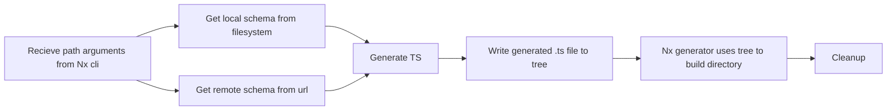

# openapi-plugin

This library was generated with [Nx](https://nx.dev).

The openapi-plugin can create api clients based on local or remote schema files. The source files must be .yaml or .json and must adhere to the OpenAPI Specification 3.0.0

## Usage

### Generating a new client

To build a new client in the clients folder:

- Run `nx g client`
- Follow the prompts to name and provide a source file

To build with flags (without needing to prompt):
Run `nx g client` with optional flags:

- --name Name of the api client.
- --schemaPath Path to the schema. If using the --remote flag then you must specify a valid remote URL. If not you must specify a local file.
- --configPath path to the redocly config file responsible for auth. For more information: https://openapi-ts.dev/cli#auth.
- --remote Specify whether you would like to fetch remotely.

### Regenerating types for an existing client

To regenerate an existing client run the same generator command again (as above). If the client already exists in the Nx project, after confirmation it will have its types file regenerated from either the provided. 
### Building

Run `nx build openapi-plugin` to build the library.

### Running unit tests

Run `nx test openapi-plugin` to execute the unit tests.

## Development

The plugin was created following the standards for Nx custom plugins. It contains a single `generator.ts` file which is responsible for the main logic behind generating the client.
For more information on client generation check [Nx plugin documentation]()

Normally, plugin generator take pre-defined files specified in the `/files` directory and automatically use that a basis for writing to a `Tree` object (the data structure Nx uses to generate files).
Since we are using `openapi-typescript` to generate files in real time, we can simply create a pre-defined template. And must therefore write to the tree ourselves. We do this by taking the output of the Typescript generation and calling a built in `write` process, to write the returned generated code into a file whilst the generator runs.

The flow for the generator is as follows:

